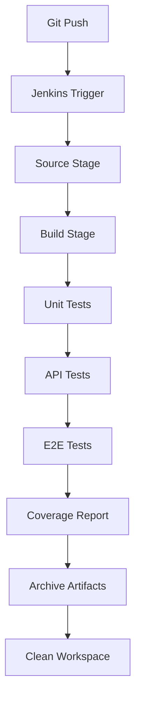

# UNIR-CICD: Proyecto de Integración y Entrega Continua

[](https://github.com/jhonnyalx/unir-cicd)
[](https://www.docker.com/)
[](https://jenkins.io/)
[](https://www.sonarqube.org/)

## 📋 Descripción del Proyecto

Este repositorio contiene una **aplicación de calculadora** desarrollada como demostración práctica de conceptos de **Integración Continua (CI)** y **Entrega Continua (CD)** utilizando Jenkins y análisis estático con SonarQube. Es un proyecto educativo diseñado para la materia de "Entornos de Integración y Entrega Continua" de la **Universidad Internacional de La Rioja (UNIR)**.

El proyecto implementa una arquitectura completa de DevOps con:
- Pipeline automatizado de CI/CD
- Suite completa de pruebas (unitarias, API, E2E)
- Análisis estático de código
- Reportes de cobertura
- Contenedorización con Docker

## 🏗️ Arquitectura y Tecnologías

### Stack Tecnológico

| Componente | Tecnología | Versión |
|------------|------------|---------|
| **Backend** | Python + Flask | 3.6 |
| **Frontend** | HTML/CSS/JS + Vue.js | Latest |
| **Contenedores** | Docker + Docker Compose | Latest |
| **CI/CD** | Jenkins | LTS JDK17 |
| **Testing** | pytest + Cypress | Latest |
| **Análisis Estático** | SonarQube | Latest |
| **UI Framework** | Bootstrap | 4.3.1 |

### Estructura del Proyecto

```
unir-cicd/
├── 📁 app/                          # Aplicación principal (API Flask)
│   ├── __init__.py
│   ├── api.py                       # Endpoints REST
│   ├── calc.py                      # Lógica de calculadora
│   └── util.py                      # Utilidades
├── 📁 web/                          # Frontend web
│   ├── index.html                   # Interfaz principal
│   ├── constants.local.js           # Configuración local
│   ├── constants.test.js            # Configuración test
│   └── Dockerfile                   # Imagen web
├── 📁 test/                         # Suite completa de pruebas
│   ├── 📁 unit/                     # Pruebas unitarias
│   │   ├── calc_test.py
│   │   └── util_test.py
│   ├── 📁 rest/                     # Pruebas de API
│   │   └── api_test.py
│   └── 📁 e2e/                      # Pruebas end-to-end
│       ├── cypress.json
│       └── cypress/
│           └── integration/
│               └── calc.spec.js
├── 📁 jenkins/                      # Configuración Jenkins
│   ├── Dockerfile                   # Jenkins personalizado
│   └── docker-compose.yml          # Orquestación
├── 📄 Jenkinsfile.simple.groovy    # Pipeline principal
├── 📄 Makefile                      # Automatización
├── 📄 Dockerfile                    # Imagen aplicación
├── 📄 sonar-project.properties     # Configuración SonarQube
└── 📄 README.md                     # Este archivo
```

## 🚀 Funcionalidades

### Aplicación Core
- ✅ **Calculadora**: Operaciones matemáticas básicas
  - Suma, resta, multiplicación, división
  - Potencia y raíz cuadrada
  - Validación de tipos y manejo de errores
- ✅ **API REST**: Endpoints HTTP para operaciones
- ✅ **Interfaz Web**: GUI responsive con Vue.js
- ✅ **Containerización**: Despliegue con Docker

### Pipeline de CI/CD
1. **🔍 Source**: Detección automática de ramas
2. **🔨 Build**: Construcción de imágenes Docker
3. **🧪 Unit Tests**: Pruebas unitarias con cobertura
4. **🌐 API Tests**: Pruebas de integración
5. **🎭 E2E Tests**: Pruebas end-to-end automatizadas
6. **📊 Coverage**: Reportes de cobertura
7. **📦 Archive**: Archivado de artefactos

## 🛠️ Requisitos y Configuración

### Prerrequisitos
- **Docker** >= 20.10
- **Docker Compose** >= 1.29
- **Make** (incluido en macOS/Linux)
- **Git**

### Instalación Rápida

```bash
# Clonar el repositorio
git clone https://github.com/jhonnyalx/unir-cicd.git
cd unir-cicd

# Construir la aplicación
make build

# Ejecutar pruebas
make test-unit
make test-api
make test-e2e

# Limpiar recursos
make clean-all
```


### Jenkins Setup

```bash
# Navegar al directorio Jenkins
cd jenkins

# Iniciar Jenkins
docker-compose up -d

# Ver logs
docker-compose logs -f jenkins

# Detener Jenkins
docker-compose down
```

## 🔧 Configuración de Jenkins

### Pipeline Automático

El archivo `Jenkinsfile.simple.groovy` define un pipeline con las siguientes características:

- **Detección automática de ramas**
- **Ejecución secuencial de stages**
- **Reportes HTML integrados**
- **Archivado automático de artefactos**
- **Limpieza automática de recursos**

### Características Especiales

```groovy
// Detección automática de ramas
def branchName = env.GIT_BRANCH ?: 
                env.BRANCH_NAME ?: 
                env.ghprbSourceBranch ?: 
                'main'

```

## 🚧 Solución de Problemas

### Problemas Comunes y Soluciones

#### 1. Error de Construcción Docker
```bash
# Verificar logs de Docker
docker logs calculator-app

# Limpiar y reconstruir
make clean-all
make build
```

#### 2. Conflictos de Red Docker
```bash
# Limpiar redes
docker network prune

# Reiniciar servicios
make clean-all
```

#### 3. Permisos en macOS
```bash
# Dar permisos al socket Docker
sudo chmod 666 /var/run/docker.sock
```

## 📈 Métricas y Resultados

### Indicadores de Calidad
- **Cobertura de Código**: >80%
- **Pruebas Automatizadas**: 100% endpoints
- **Pipeline Success Rate**: >95%
- **Build Time**: <5 minutos

### Reportes Disponibles
- **Coverage Report**: `results/coverage/index.html`
- **Unit Test Report**: `results/unit_result.xml`
- **API Test Report**: `results/api_result.xml`
- **E2E Test Report**: `results/cypress_result.xml`

## 🔄 Flujo de Trabajo CI/CD

